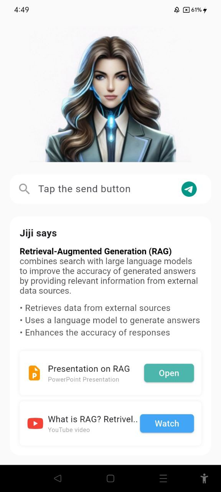
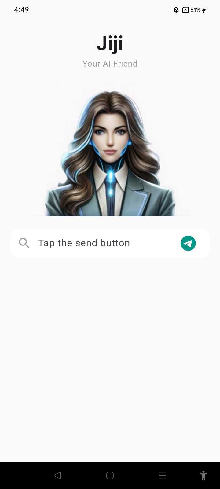

lib/
├── main.dart
├── features/jiji/
│   ├── bloc/
│   │   ├── jiji_bloc.dart
│   │   ├── jiji_event.dart
│   │   └── jiji_state.dart
│   └── presentation/
│       ├── screens/
│       │   └── jiji_screen.dart
│       └── widgets/
│           ├── jiji_avatar.dart
│           ├── search_bar.dart
│           ├── answer_section.dart
│           └── resource_card.dart

## Usage

1) Launch the application.
2) The Jiji – Your AI Friend landing screen is displayed.
3) Enter a topic in the search bar (e.g., Explain RAG).
4) Tap the Send icon.
5) A chat-style response from Jiji appears below the search bar.
6) Resource cards (Presentation & YouTube) are shown for demonstration purposes.

## Answer section will be displayed once you click on the send button !!

## 📸 Screenshots

### Home Screen

### Response View

